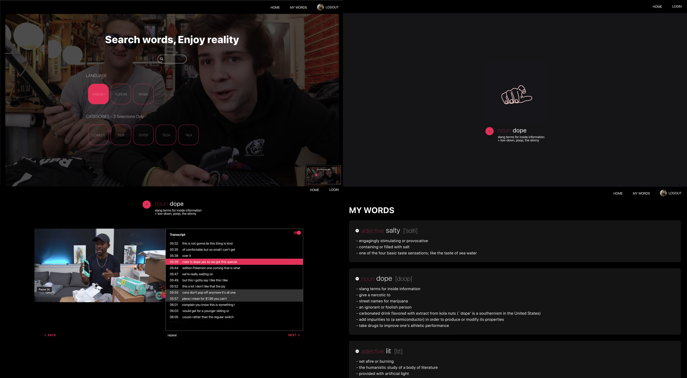

# getSample (Client and Server)

This application provides native speakers' language usages by YouTube videos.

[[Link to demo video]](https://www.youtube.com/watch?v=OFxVRNepHiw)



## Features

- Login with Google (Google Oauth, Passport.js)

- Search words by Language and Category in YouTube video scripts (Google YouTube Data API)

- Start a video from a scene including a searched word

- Highlight a searched word

- Move video play time to clicked text time

- Sync scripts to video scenes with highlighting (YouTube iFrame Player API)

- Search word definitions, synonyms, parts of speech in dictionary (Words API)

- Save and delete words in user's own word lists

## Prerequisites

Get a Google OAuth 2.0 client ID
- Go to the [Google API Console](https://console.developers.google.com/)
- Create OAuth 2.0 client ID [[how to link]](https://developers.google.com/identity/protocols/OAuth2)
- Copy and paste redirect url in google.json file codes
- Get `<YOUR CLIENT ID>` and `<YOUR CLIENT SECRETE>`

Get a Google API Key
- Go to the [Google API Console](https://console.developers.google.com/)
- Create API KEY [[how to link]](https://developers.google.com/identity/protocols/OAuth2)
- Get a `<YOUR GOOGLE API KEY>`

Get a RapidAPI API Key
- Go to the [RapidAPI](https://rapidapi.com/)
- Add new App
- Get an Application Key, `<YOUR X_RAPID API KEY>` in Security tab

Get a MongoDB Connection URL
- Go to the [MongoDB Atlas](https://cloud.mongodb.com/)
- Select Connect Your Application
- Get a Connection String URI, `<YOUR MONGO_DB CONNECTION URL>`

## Installation

```
// Server

git clone https://github.com/letsdoyi/getSample-Server.git

cd getSample-Server

mkdir config
cd config

touch google.json
open google.json // Copy and paste the code below in this file

touch keys.js
open keys.js // Copy and paste the code below in this file

touch .env
open .env // Copy and paste the code below in this file

cd..

npm install

npm run dev

cd..

// Client

git clone https://github.com/letsdoyi/getSample-Client.git

cd getSample-Client

npm install

npm start

```

### `google.json`
```
{
  "web": {
    "client_id": <YOUR CLIENT ID>`,
    "project_id": "video-example-dictionary",
    "auth_uri": "https://accounts.google.com/o/oauth2/auth",
    "token_uri": "https://oauth2.googleapis.com/token",
    "auth_provider_x509_cert_url": "https://www.googleapis.com/oauth2/v1/certs",
    "client_secret": <YOUR CLIENT SECRETE>,
    "redirect_uris": ["http://localhost:4000/api/auth/google/callback"]
  }
}

```
### `keys.js`

```
module.exports = {
  google: {
    apiKey: <YOUR GOOGLE API KEY>,
  },
  session: {
    cookieKey: <YOUR RANDOM STRING>,
  },

  X_Rapid: {
    apiKey: <YOUR X_RAPID API KEY>
  }
};
```

### `.env`

```
MONGOOSE_URL = <YOUR MONGO_DB CONNECTION URL>
CLIENT_URL = http://localhost:3001
```

## Tech Skills

### Client Side [[Click to Client Side]](https://github.com/letsdoyi/getSample-Client)

- JavaScript (ES2015+)

- React for component-based-architechture

- Redux for state management

- HTTP request using Axios

- Google YouTube Data API

- Google OAuth

- Passport.js, authentication middleware from node.js

- Sass, stylesheet


### Server Side

- Node.js

- Express, Node.js web-application framework

- Mongo DB Atlas

- Mongoose, object data modeling library for Mongo DB Atlas

- Proxy, for client-server integration


## Test

- Jest and Enzyme for Unit test

- Cypress, JavaScript End-to-End testing framework


## Version and Schedule Control

- Git, Github [[Previous Git Commit Records Link]](https://github.com/letsdoyi/getSample_git-records)

- Trello for managing scheluled tasks


## Challenges

- Short Time Period, 2 weeks: Task Time Schedule Management

  2 weeks, a short time for completing this project got me under pressure. I separated this project into a small task unit according to my deadline. However, sometimes a small task took a longer time than I expected because I was faced with unexpected situations. For instance, before starting this project, I could not get YouTube subscription Infomation which got successfully when I tested YouTube Data API because my website domain is not verified. Verifying takes 2 - 3 weeks. I ended up consumed much time searching for solutions. I learned how important testing before starting a project is and practiced to decide what is a priority.

- Short Quota Limit: YouTube Data API

  To search a word in this application, it goes through steps fetching Youtube data. in the first plan, it got 10 - 15 Youtube channel ids in categories which user selected and then, 25 video ids per Youtube Channel by YouTube Data API. They are up to 1,125 times of API requests, which are exceeded daily quota limit with 3 - 4 trials. I tried to reset quota by refreshing the API key or sent a request email to reset the quota. However, they were time-consuming tasks and were not enough to develop the Application. So I saved the channel ids and the video ids in a file and using the data instead of request data to Youtube whenever getting every search request. This method is not fetching the lastest video ids in a channel but is able to deal with the more data requests from the client-side.

- Search Logic Implememt: Getting Accurate Search Result

  This application traces timed text captions to find a word. Designing accurate search logic was challenging because there were many cases to consider. For example, finding a word, 'test' needs to exclude words started with test- such as 'testimony' and 'testify'. Also, it needs to include ended with special characters and spacing. The search logic in this application deals with typical cases such as '!', ',' and spacing. It could make me practice thinking about search edge cases. Next time, I would like to design logic by covering with the more edge cases than in this application.

- Open Module Error Handling: Try / Catch, Continuous Flow

  In this application, an open module named Youtube Captions Scraper is used. However, because it mainly designed fetching captions about one video, in this application the module didn't work perfectly. while finding captions of videos, if fetching video captions is not available, my search word API processing stopped. Therefore, in case of no video caption, I caught the module error by using a try/catch statement and continuously skip to the next video id.

- Video timed transcript Sync Implement

  The implementation of captions synced to a video player was challenging. It solved with Redux and Youtube API. I changed a state at the begin and end of timed-text caption by Youtube iframe API and highlighted relevant caption section checking timed text if in between the times. About moving playtime to the time of clicked caption, when the same caption was clicked, the player was not moving to the start time because of not rerendering with the same state value. So, whenever the same caption was clicked, I changed state value as +0.001 or -0.001. I could understand about Redux and React deeply through these challenges.

## Things To do

- [ ] Practice scheduling task

- [ ] Improving search speed

- [ ] Improving the search logic

- [ ] Adding a word in the word list link to search result

- [ ] Adding scrolling to hightlight caption

- [ ] Adding Youtube channel register function for providing the latest video data

- [ ] Changing fetching local data to realtime data by requesting to YouTube

- [ ] Improving Reactive design for component reusability

- [ ] Refactoring for code reusability